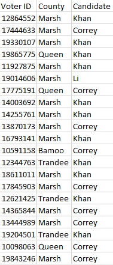
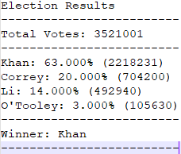

# Vote Tally Analyzer

## Author

Ashley Sligh

## Programming Language/Tools Applied

Python, VS Code, CSV

## Purpose

The purpose of the PyPoll application is to analyze voter ballots and generate election results to both the terminal at to text file using a scaleable, object-oriented approach.

## Instructions

To run the PyPoll program perform the following steps:
1) Download the project to your local machine
2) Open a Bash session and CD to the "PyPoll" folder location
3) Type "Code ." to launch VS Code
4) Click the "Run" button to launch the program
5) Results written to the analysis/election_data_analysis.txt path

## Illustrative Input Data Sample

## Illustrative Data Output

